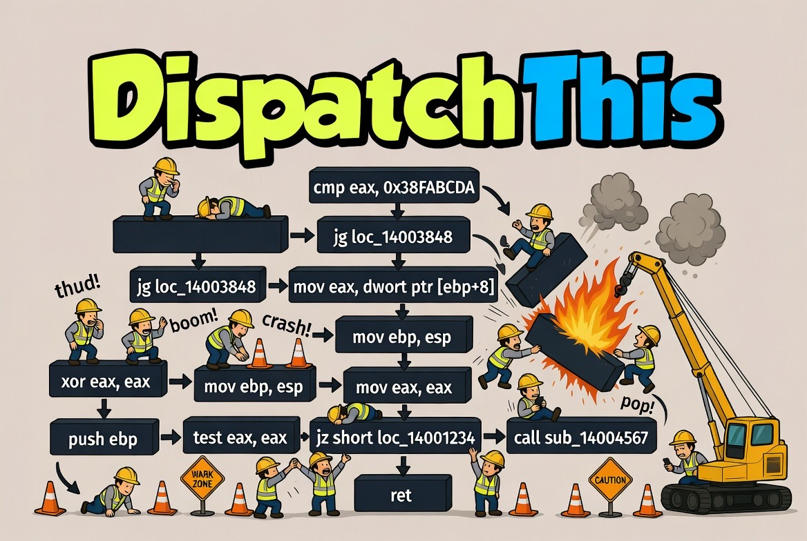
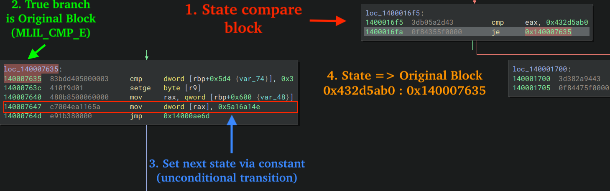
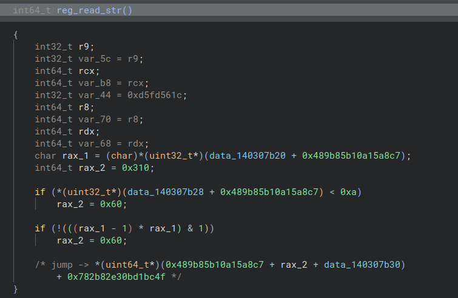
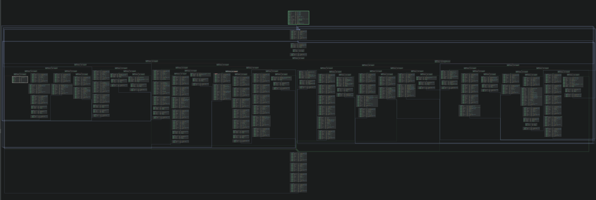
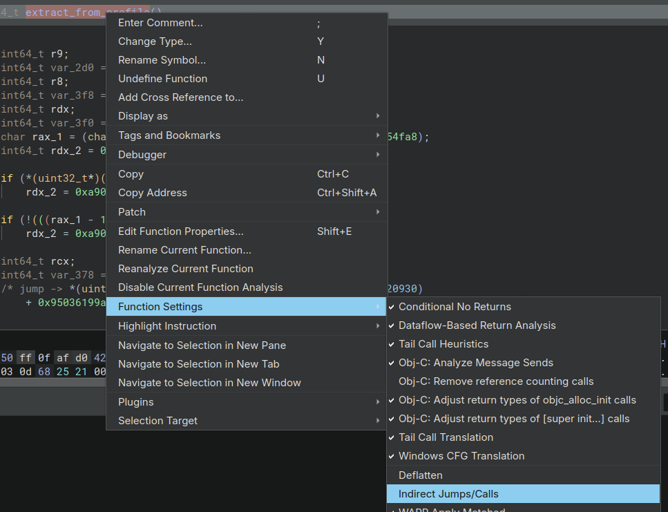

  

# DispatchThis

> Your obfuscating compiler can **DispatchThis** 😛
> An IL-level deobfuscator for an **indirect jump + indirect call + control flow flattener**, built as 
> a [Binary Ninja](https://binary.ninja/) Workflow.

> [!WARNING]
> **Educational Proof of Concept.**
> Treat it as an example of IL-level deobfuscation inside a Binary
> Ninja workflow. See [`docs/known-issues.md`](docs/known-issues.md) for additional context.
> Pull requests are welcome!

## What it does

The target obfuscator flattens control flow with a **compare-tree dispatcher** keyed on a
**state variable**, and routes to original blocks through **COMPARE EQUAL** or **COMPARE NOT EQUAL**.
Dispatcher state tokens may be wider than 32 bits.
An annoted portion of one of the functions analyzed is shown in the figure below.

DispatchThis recovers the original control flow **entirely at
the IL level** - every transformation is an *IL expression rewrite* performed inside a
clone of Binary Ninja's `core.function.metaAnalysis` workflow. **No bytes are ever
patched.**

> [!NOTE]
> **Why a workflow / IL rewriting?** Replacing IL expressions with Binary Ninja Workflows
is incredibly versatile: whole expressions and control-flow edges, unconditional jumps and conditional expressions
> are replaced in the IL following state to Original Basic Block resolution, ultimately eliminating
> the need to patch assembly - a process that can be incredibly burdensome.

For the full obfuscation breakdown including indirect jumps, opaque predicates, control flow flattening
constant, and indirect call gadgets from the sample, see [`docs/obfuscation.md`](docs/obfuscation.md).

## See it in action

**Before - analysis stalls at the first indirect jump.** Because every transition routes through
a `jump(reg)` whose target is computed at run-time, the disassembler cannot follow control flow
past the first jump gadget, and most of the function is never recovered:

**After the indirect-jump resolver - control flow reconnected.** Each `jump(reg)` has been decoded and rewritten to a direct branch, so Binary Ninja discovers the remaining blocks and the real graph re-emerges:

**Recovered pseudocode.** With decode-gadget branch and call targets resolved, phase cleanup removing dead target-decode assignments, deflattening reconnecting the dispatcher exits, and deflatten cleanup NOPing dispatcher state writes, the function decompiles to readable pseudocode:

## Installation

### Prerequisites

- Binary Ninja (see [Compatibility](#compatibility)).
### Install the plugin

Copy the folder located in the "plugins/DispatchThis" directory into your Binary Ninja user plugins directory and 
restart Binary Ninja.

For example: `~/.binaryninja/plugins/DispatchThis`

| OS | Plugins path |
| --- | --- |
| **macOS** | `~/Library/Application Support/Binary Ninja/plugins/` |
| **Linux** | `~/.binaryninja/plugins/` |
| **Windows** | `%APPDATA%\Binary Ninja\plugins` |

## Usage

The fastest way to test one function is the function context menu. With the
target function open, right-click inside the function and use:

- **DispatchThis ▸ Profile ▸ Use default** or **Use dyzznb** - selects the active
  resolver profile for the current BinaryView.
- **DispatchThis ▸ Toggle Resolver** - toggles only indirect jump/call resolving
  for the current function.
- **DispatchThis ▸ Toggle Deflatten** - toggles only deflattening for the current
  function.
- **DispatchThis ▸ Toggle String Decrypt** - toggles only string decrypt for the
  current function.
- **DispatchThis ▸ Disable All** - disables all DispatchThis function toggles for
  the current function.

Default shortcuts are `Ctrl+Alt+Shift+R` for Resolver, `Ctrl+Alt+Shift+D` for
Deflatten, `Ctrl+Alt+Shift+S` for String Decrypt, and `Ctrl+Alt+Shift+X` for
Disable All.

The passes are enabled per-function from the **Function Settings** context menu. With the target function open in a disassembly or graph view, **right-click anywhere inside the function** and choose **Function Settings**. Three plugin entries appear:

- **Indirect Jumps/Calls** - enables the indirect-jump and indirect-call resolvers for this
  function. Once enabled, reanalysis runs automatically and the Control Flow Graph will
  visibly *grow* in the disassembly view as each resolved jump reconnects previously
  unreachable blocks. Re-runs to a fixpoint, so the graph keeps expanding until no more
  targets can be decoded. If reanalysis does not trigger automatically, run it manually via
  *Analysis ▸ Reanalyze All Functions*.

- **Deflatten** - enables the deflattener and the final state-write cleanup together. The deflattener
  rebuilds the original control flow graph, and the cleanup pass then removes dispatcher
  state writes recorded by deflattening. The result is a cleaner function in the pseudocode view with the
  dispatcher overhead stripped out. If reanalysis does not trigger automatically, run it
  manually via *Analysis ▸ Reanalyze All Functions*.

- **String Decrypt** - enables the resolver prerequisites for the string-decrypt workflow,
  then annotates direct calls to recognized, deflattened string decrypt functions with
  recovered plaintext comments.

**Deflatten depends on indirect branch resolving.** The Deflatten setting also enables the
indirect branch and indirect call resolvers, so the full CFG can become visible before the
deflattener reconstructs dispatcher edges. Deflatten cleanup only runs after the
deflattener has rewritten the dispatcher exits, so unresolved indirect branches usually
leave the deflatten workflow phase idle.

## Pipeline at a glance

Eight workflow activities are inserted per function. One is the no-op
`Indirect Jumps/Calls` setting activity; the remaining seven are recovery workflow phases:

1. **Indirect Jumps/Calls toggle** (LLIL insertion point) - surfaces the per-function
   resolver setting.
2. **Indirect branch resolver** (LLIL) - rewrites each decode-gadget `jump(reg)` into
   `jump(const)` in the current IL. The workflow callback owns user branch metadata and
   analysis-completion tag cleanup scheduling. Re-runs to a fixpoint as the function grows.
3. **Indirect call resolver** (MLIL) - folds each import call's decode and rewrites the
   call destination to a constant pointer. The workflow callback owns call type adjustments
   and call-target phase cleanup.
4. **Branch condition translator** (MLIL) - turns resolved two-target indirect branch
   switches back into `if` expressions, then runs branch-target phase cleanup.
5. **Global constant resolver** (MLIL) - types read-only global pointer slots as constants.
6. **String decrypt** (MLIL, *opt-in*) - waits for branch, call, and global phases to
   stabilize for the current function, then annotates recognized direct decrypt calls.
7. **Deflattener** (MLIL, *opt-in*) - recovers the dispatcher cluster and rewrites each
   original basic block's dispatcher jump into a direct `goto` to the real successor.
   Conditional transitions are reconstructed when each branch arm selects one dispatcher
   state token.
8. **Deflatten cleanup / NOP pass** (MLIL, *opt-in*) - NOPs dispatcher state writes
   recorded by deflattening.

Full details, ordering rationale, and the `session_data` contract are in
[`docs/pipeline.md`](docs/pipeline.md); workflow phase coordination rules live in
[`docs/adr/0003-function-phase-state-for-workflow.md`](docs/adr/0003-function-phase-state-for-workflow.md).
Conditional deflattening has its own write-up in
[`docs/conditional-deflattening.md`](docs/conditional-deflattening.md). A file-by-file map
of the source is in [`docs/files.md`](docs/files.md).

## The sample

This project was built and tested against a single sample, `FortiEndpoint_Patch.exe`.

> [!CAUTION]
> Only analyze in an isolated environment:
>
> - **VirusTotal:** <https://www.virustotal.com/gui/file/0da123adf9251957a4b850a3f6bd6a753dd4892be176a84a18450e899534cc5e>
> - **SHA-256:** `0da123adf9251957a4b850a3f6bd6a753dd4892be176a84a18450e899534cc5e`

## Compatibility

Built and tested on **Binary Ninja 5.3.9757 (a99f2380)**. The workflow and IL-rewriting
features it depends on were introduced in **3.3.3996 (2023-01-18)**, which is effectively
the minimum version required to support IL re-writes. It has only been exercised on 5.3.9757,
however, so earlier releases may behave differently.

## Credits

Though this project is an entire new code-base, it was inspired after I studied the behavior of 
[RPISEC/llvm-deobfuscator](https://github.com/RPISEC/llvm-deobfuscator).

## License

Released under the [MIT License](LICENSE).
